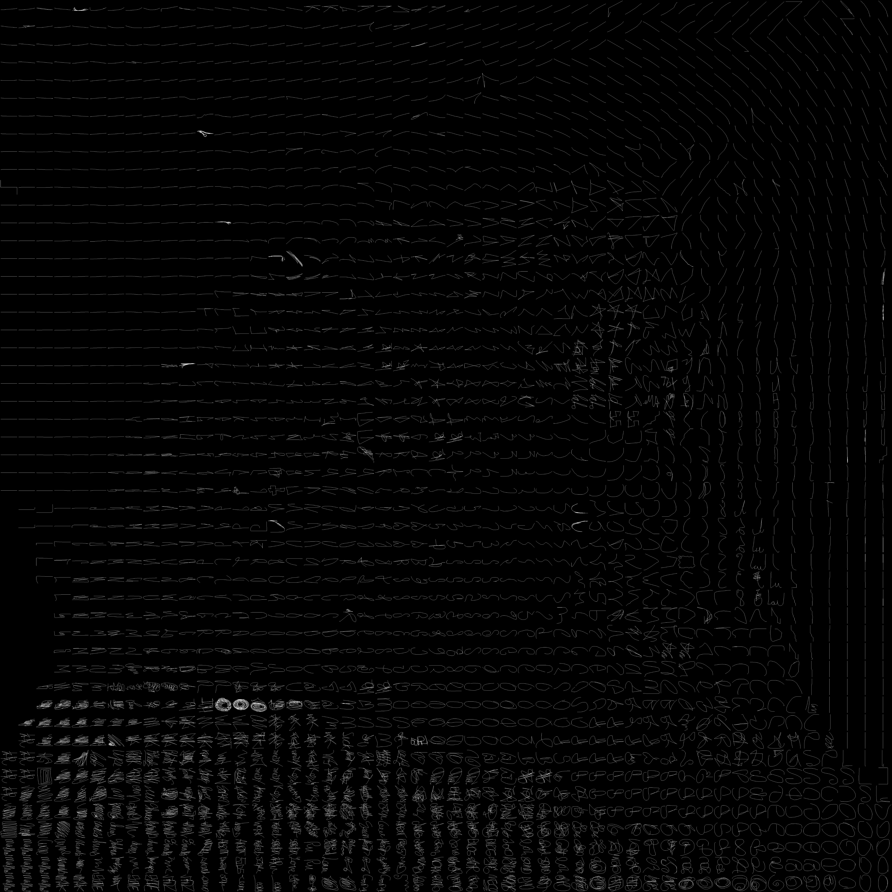
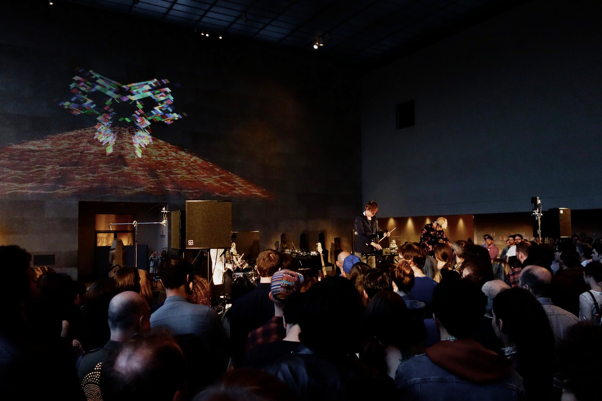

# ofxGML

TSNE Grid of 100x100 Strokes from [000000Book](http://000000book.com/) created with [ofxTSNE](https://github.com/genekogan/ofxTSNE) and [ofxCcv](https://github.com/kylemcdonald/ofxCcv)

Graffiti Markup Language Addon for Reading and Writing GML files  

##Apps

### examples-strokes && examples-tags

These examples were written to extract GML strokes and tags into individual images.  They are centered, normalized, and scaled to fit within the texture.  The output is saved to a file for futher analysis.

External Addons needed for this example:
- ofxGML (this addon)
- [@satoruhiga's ofxFastFboReader](https://github.com/satoruhiga/ofxFastFboReader)

### example-playback

WIP

### example-capture

WIP

### advanced-playback

WIP

### tagCaptureSimple

VJing tool from my performance with [Liars at the Metropolitan Museum of Art](http://makeitdoathing.com/index.php/2013---liars-/).  It was adapted from Theo Watson et.al. LaserTag 2.0 codebase. 

### gmlVJ

WIP
